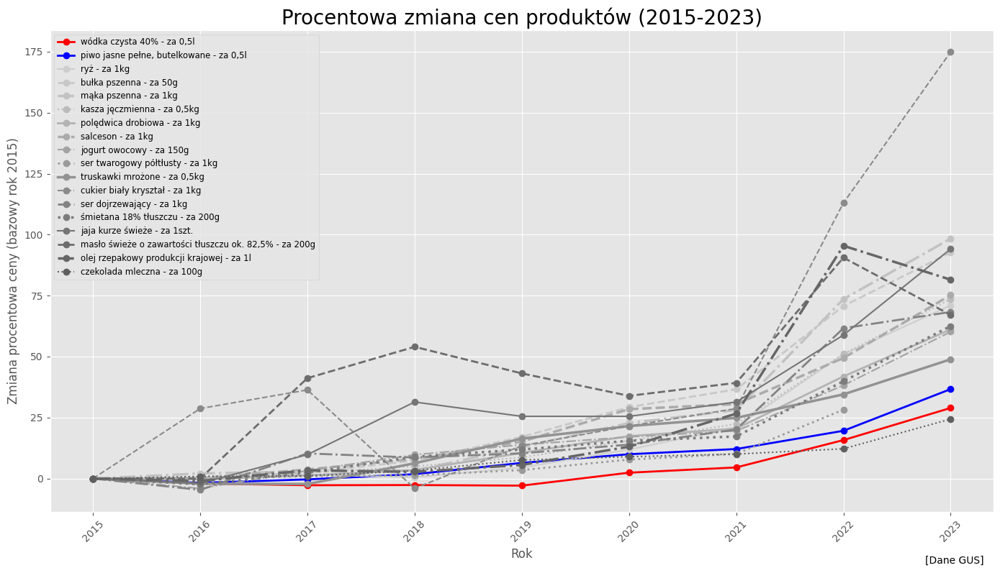
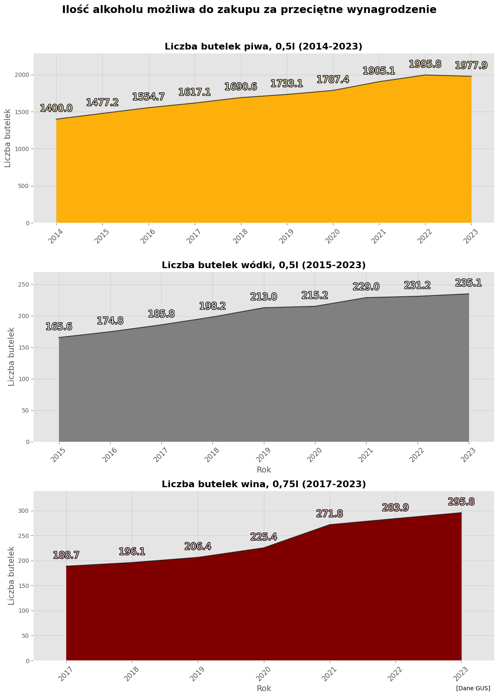
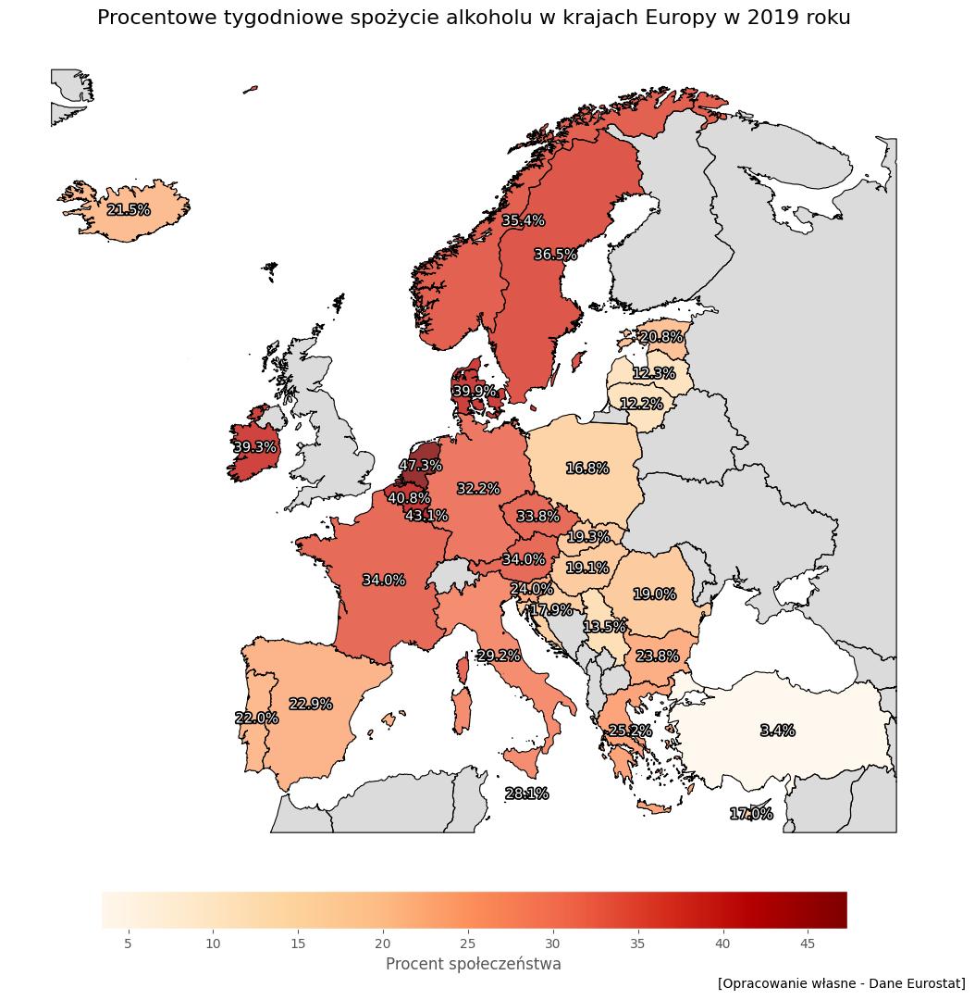
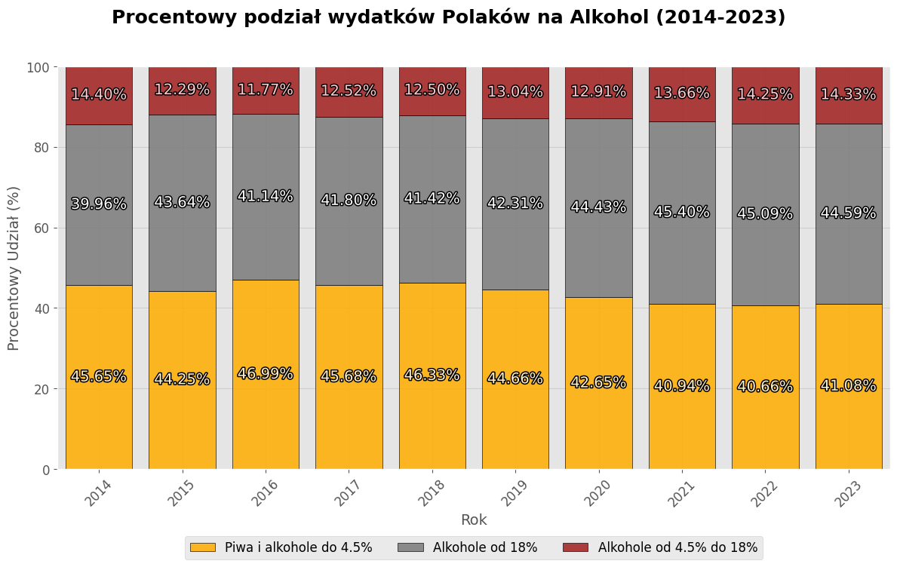

# Alcohol Market in Poland and Europe — Consumption, Prices and Affordability

Course project for *Obliczenia naukowe w naukach społecznych* (ONS-2024Z), Computational
Engineering, ICM University of Warsaw. Course instructor: dr hab. Dominik Batorski.

A data analysis of how alcohol affordability, pricing and consumption patterns have changed
in Poland between 1990 and 2023, and how Poland compares to the rest of Europe. Built from
GUS, KCPU/PARPA, Eurostat and WHO data with an automated ingestion pipeline in Python.

📄 [Full report (PDF, Polish)](./ALKOHOL_ANALIZA-ONS-2024Z%20-%20FILIP%20RUSIECKI.pdf) ·
📓 [Notebook](./ONS_ANALIZA_ALKOHOL.ipynb) ·
[](https://colab.research.google.com/github/RusieckiFilip/Inzynieria_Obliczeniowa_UW/blob/main/ONS_ANALIZA_ALKOHOL.ipynb)

---

## Three findings

### 1. Alcohol got cheaper relative to everything else

Between 2015 and 2023 the price of vodka rose 29% and beer 37%. Over the same period,
staple foods rose between 50% and 175%. Indexed against the same base year, alcohol sits at
the very bottom of the basket.



This happened despite systematic excise increases — beer excise alone rose over 25% from
2021, with further statutory increases of 10% in 2022 and 5% annually through 2027. Excise
on beer is levied per hectolitre-degree Plato rather than as a percentage of price, so large
relative increases on a small base move the shelf price only slightly; retail competition
absorbs much of the rest.

### 2. Affordability rose faster than prices

Prices are the wrong question. The right one is how much an average salary buys.



An average monthly salary bought roughly **40% more beer and vodka in 2023 than in 2014**.
Wage growth (~88% over the period) outpaced alcohol price growth by a wide margin, so
alcohol became substantially more accessible even as its nominal price rose.

> ⚠️ **Series break in the wine data.** GUS changed the tracked product in 2021, from
> *"wino białe gronowe, wytrawne"* (dry white grape wine) to *"wino białe gronowe"* (any
> white grape wine). The two are different baskets. The visible jump between 2020 and 2021
> in the wine panel is largely this definition change, not a real price movement — treat
> the wine figures as indicative only.

### 3. Poland drinks rarely and heavily; the Mediterranean drinks often and lightly

This is the most counterintuitive result in the project.

| | Drinks daily | Annual consumption per capita |
|---|---:|---|
| Portugal | 20.7% | lower than Poland |
| Italy | 12.1% | lower than Poland |
| **Poland** | **1.6%** | **higher than both** |

Only 1.6% of Poles drink daily — one of the lowest rates in Europe — yet Poland's annual
per-capita consumption exceeds countries where daily drinking is ten times more common.

The explanation is the *pattern*, not the frequency. In southern Europe alcohol is a routine
part of meals, consumed in small quantities. In Poland drinking is occasional but
concentrated into large single sittings. Infrequent heavy consumption produces a higher
annual total than frequent light consumption. The average is additionally pulled upward by
the subgroup with alcohol dependence.



---

## A note on survey methodology

Eurostat's EHIS survey offers **daily** and **weekly** frequency categories, and this
project reports the **weekly** figure throughout. That is a deliberate choice.

Someone who drinks every second day will not self-identify as a daily drinker, so the
"daily" category systematically under-counts regular consumption. The weekly category
absorbs those respondents and is the more informative measure — particularly for Poland,
where the daily figure (1.6%) is low enough that small reporting biases dominate it.

Two further caveats carried through the analysis:

- **The primary-education group is probably unrepresentative in Poland.** It consists
  largely of older respondents, who drink less for reasons unrelated to education. The
  cross-country comparison of this category is also weakened by different ISCED
  distributions between countries.
- **Self-reported consumption is culturally conditioned.** In southern Europe wine with a
  meal carries no stigma; in Poland alcohol is more readily associated with problem
  drinking, which plausibly depresses reported figures.

---

## Consumption structure over time



Beer's share of alcohol spending fell after 2020, from ~46% to ~41%. Non-alcoholic beer is
a plausible driver: its share of the beer market grew from 1.9% in 2017 to 6.5% in 2021,
and it does not appear in alcohol spending at all, so substitution moves the share
mechanically.

**The 2002 excise cut is a measurement artifact worth flagging.** Official statistics show
vodka consumption jumping after excise was cut 30% in 2002. Consumption did not actually
jump — the grey market, estimated at around 40% of the vodka market before the cut, migrated
into the legal market and therefore into the statistics. By 2010 the grey share had fallen
to roughly 10%. Any pre-2002 consumption series for spirits substantially understates the
real level.

---

## Data and reproducibility

| Source | Used for |
|---|---|
| **GUS** | Retail prices (alcohol and staples), monthly household spending, population |
| **KCPU / PARPA** | Per-capita consumption by beverage type, 2014–2023 |
| **Eurostat** (`hlth_ehis_al1e`) | Consumption frequency by country, sex, age, education |
| **WHO** | Annual per-capita consumption, cross-country |
| **Nielsen, Browary Polskie, Synergion** | Market reports cited in the text |

The notebook pulls GUS and PARPA spreadsheets directly from `DATABASES/` in this repository
via the GitHub API, and Eurostat tables through the `eurostat` package, so no manual file
handling is needed. Spending figures are deflated to 2017 prices using a price index built
from the GUS series, so trends reflect real rather than nominal changes.

```bash
pip install pandas openpyxl eurostat geopandas pycountry matplotlib contextily
```

Then run the notebook top to bottom, or open it in Colab with the badge above.

---

## Known limitations

- The wine price series is spliced across the 2021 GUS definition change (see above).
- The three price panels cover different windows — beer 2014–2023, vodka 2015–2023, wine
  2017–2023 — because the underlying GUS series start at different points. Comparisons of
  growth rates between them are affected by the window, not only by the products.
- The claim that the industry deliberately holds prices down is speculation, labelled as
  such in the report. The excise structure and retail competition explain most of the effect
  without needing that assumption.
- Affordability and consumption are analysed in separate sections and never plotted against
  each other. The central question of the report — whether rising affordability drives
  consumption — is therefore argued narratively rather than shown.
- All consumption figures are self-reported survey data or registered sales; neither
  captures unrecorded consumption well.

---

## Sources

Komuda (2006), *Podatki w dół, procenty w górę*, AgroTrendy 29 ·
WHO (2018), [Global status report on alcohol and health](https://www.who.int/publications/i/item/9789241565639) ·
Bujalski, M. (2012), Instytut Psychiatrii i Neurologii — Nordic alcohol policy in the EU/EEA ·
Borowska, A. (2009), *Przemiany na rynku napojów alkoholowych w Polsce w latach 1990–2007* ·
Browary Polskie, *Rewolucja 0,0% na rynku piwowarskim* ·
[Synergion — Dokąd płynie mała wódka](https://synergion.pl/czytelnia/raport-z-badan-rynku-dokad-plynie-mala-wodka/) ·
GUS · Eurostat · KCPU · WHO
